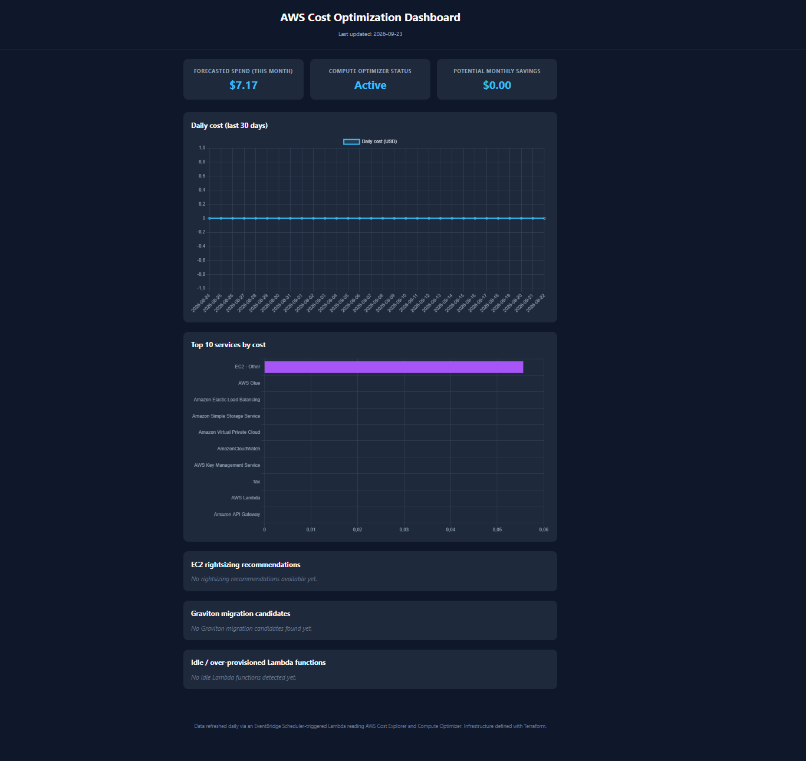
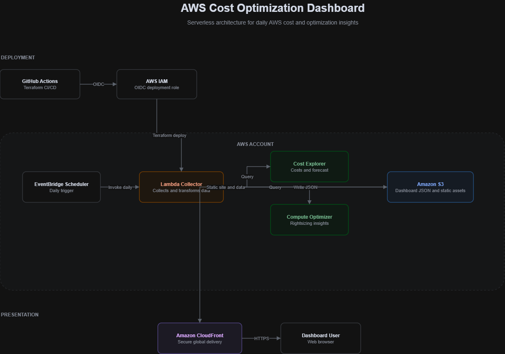

<div align="center">

# AWS Cost Optimization Dashboard

**A serverless AWS FinOps dashboard for cost visibility and optimization insights.**

[Live Demo](https://d76jvyk0p329e.cloudfront.net) · [Architecture](#architecture) · [Features](#features) · [Deployment](#deployment) · [Project Structure](#project-structure)


</div>

> A Terraform-managed, serverless dashboard that collects AWS Cost Explorer and Compute Optimizer data through Lambda and presents it through a static frontend delivered by CloudFront.

<div align="center">

### [🌐 View Live Dashboard](https://d76jvyk0p329e.cloudfront.net)

</div>

---

## Overview

This project is a serverless AWS cost-optimization dashboard built to provide practical visibility into cloud spending and optimization opportunities. It combines **AWS Cost Explorer** and **AWS Compute Optimizer** data to surface forecasted spend, daily cost trends, service-level costs, EC2 rightsizing recommendations, Graviton migration candidates, and idle or over-provisioned Lambda findings — all without running a persistent server.

The architecture is intentionally lightweight: **Amazon EventBridge Scheduler** invokes a Lambda collector once per day, the collector writes a JSON data file to **Amazon S3**, and a static frontend reads and renders that data through **Amazon CloudFront**.

This project demonstrates applied FinOps automation: integrating AWS billing and optimization APIs, transforming operational data, and delivering it through a serverless Infrastructure-as-Code pipeline with short-lived CI/CD credentials.

## Why this project

Cloud costs are easy to accumulate and difficult to interpret without a consolidated view. This dashboard turns billing and optimization APIs into a small, automated operational surface that helps answer three practical questions:

- What is the account spending and how is that trend changing?
- Which AWS services contribute most to current spend?
- Where might rightsizing or workload optimization be possible?

## See it in action

The dashboard is publicly deployed and renders account-specific AWS data.

### Dashboard preview



### Example results

Snapshot from a recent run. Values are account- and date-specific and change as AWS billing data updates.

| Metric | Value |
|---|---|
| Forecasted spend (current month) | `$7.17` |
| Compute Optimizer status | `Active` |
| Potential monthly savings | `$0.00` (no recommendations available in the snapshot) |
| Top service-level cost category | `EC2 - Other` |
| Empty recommendation handling | Verified — the dashboard renders safely without recommendations |

## Architecture



### Flow summary

- **Deployment** — GitHub Actions authenticates to AWS with OpenID Connect (OIDC) and runs Terraform without long-lived AWS access keys.
- **Scheduling** — Amazon EventBridge Scheduler invokes the collector Lambda once per day.
- **Collection** — Lambda queries Cost Explorer for daily cost, service-level spend, and the monthly forecast.
- **Optimization** — Lambda queries Compute Optimizer for EC2 rightsizing, Graviton, and Lambda optimization findings when available.
- **Storage** — The collector writes generated dashboard data to Amazon S3.
- **Delivery** — CloudFront serves the static dashboard and generated data over HTTPS.

## Main components

| Component | Purpose |
|---|---|
| GitHub Actions | Validates and deploys infrastructure with Terraform. |
| GitHub OIDC + AWS IAM | Provides short-lived deployment credentials without static AWS keys. |
| Amazon EventBridge Scheduler | Triggers the daily collector run. |
| AWS Lambda (Python) | Collects, transforms, and writes cost-optimization data. |
| AWS Cost Explorer | Supplies daily cost, top services, and forecasted spend. |
| AWS Compute Optimizer | Supplies EC2 rightsizing, Graviton, and Lambda optimization findings. |
| Amazon S3 | Stores the static frontend and generated dashboard JSON. |
| Amazon CloudFront | Delivers the dashboard globally over HTTPS. |
| Terraform | Defines cloud infrastructure as code, including the remote state backend. |

## Features

- Current-month AWS spend forecast.
- Last 30 days of daily cost data.
- Top AWS services by cost.
- Compute Optimizer enrollment status.
- EC2 rightsizing recommendations when AWS has enough workload telemetry.
- Graviton migration candidates when available.
- Idle or over-provisioned Lambda findings.
- Safe empty states for accounts without recommendations.
- Automated daily data refresh.
- Terraform-managed infrastructure across separate backend, dashboard, and collector stacks.
- CI/CD with GitHub Actions and AWS OIDC authentication.

## Deployment

The repository contains three Terraform stacks:

```text
infra/
├── backend/     # Remote Terraform state backend
├── dashboard/   # S3 and CloudFront static dashboard infrastructure
└── collector/   # Lambda collector and EventBridge Scheduler infrastructure
```

On a push to `main` that changes `infra/`, `src/`, or `.github/workflows/deploy.yml`, GitHub Actions:

1. Checks out the repository.
2. Configures short-lived AWS credentials through GitHub OIDC.
3. Initializes and validates Terraform.
4. Plans and applies the dashboard stack.
5. Retrieves the dashboard bucket name as a Terraform output.
6. Plans and applies the collector stack with that bucket name.

The workflow requests only these GitHub permissions:

```yaml
permissions:
  id-token: write
  contents: read
```

## Local deployment

### Prerequisites

- Terraform 1.9.5 or a compatible release.
- AWS CLI configured with permissions for the required resources.
- AWS Cost Explorer enabled in the target account.
- AWS Compute Optimizer enabled to receive optimization recommendations.

### Deploy the backend

```bash
cd infra/backend
terraform init
terraform apply
```

### Deploy the dashboard

```bash
cd ../dashboard
terraform init
terraform validate
terraform plan
terraform apply
```

### Deploy the collector

Use the dashboard bucket name returned by the previous stack:

```bash
cd ../collector
terraform init
terraform validate
terraform plan -var="dashboard_bucket_name=<your-dashboard-bucket-name>"
terraform apply -var="dashboard_bucket_name=<your-dashboard-bucket-name>"
```

## Project structure

```text
.
├── .github/
│   └── workflows/
│       └── deploy.yml              # OIDC-based deployment workflow
├── docs/
│   └── images/
│       ├── architecture.png        # Architecture diagram
│       └── dashboard.jpg           # Dashboard preview
├── infra/
│   ├── backend/                    # Terraform remote state backend
│   ├── dashboard/                  # S3 and CloudFront Terraform stack
│   └── collector/                  # Lambda and EventBridge Terraform stack
├── src/
│   ├── dashboard/                  # Static frontend assets
│   └── collector/                  # Lambda collector code (Python)
├── .gitignore
├── LICENSE
└── README.md
```

## Security and operational notes

- GitHub Actions uses OIDC with short-lived AWS credentials instead of stored access keys.
- Keep Terraform state protected and never commit local state files, plans, credentials, or generated secrets.
- Apply least-privilege IAM policies when adapting the project to another account.
- Configure AWS Budgets and billing alerts before using the dashboard in a production environment.
- The public demo is intended for portfolio and educational purposes; do not expose sensitive account data without reviewing the distribution model.

## Limitations

- Cost Explorer data can have reporting and forecast delays.
- Compute Optimizer recommendations depend on enrollment and sufficient workload telemetry.
- Empty recommendation datasets are expected for new, low-traffic, or lightly used environments.
- The example values above are a dated snapshot and should not be interpreted as current account totals.

## Cost considerations

The design keeps operational overhead low:

- The frontend is static and delivered from S3 through CloudFront.
- The collector executes once per day.
- Lambda execution is short-lived.
- The generated JSON data is small.

Actual charges depend on account usage and AWS service pricing, including Cost Explorer, CloudFront, S3, Lambda, and monitored resources.

## Technologies

**Cloud & Infrastructure:** AWS S3 · Amazon CloudFront · AWS Lambda · Amazon EventBridge Scheduler · AWS Cost Explorer · AWS Compute Optimizer · AWS IAM

**IaC & CI/CD:** Terraform · GitHub Actions · GitHub OIDC

**Application:** Python (collector) · HTML, CSS, JavaScript (frontend)

## Related project

This project complements my [Cloud Resume Challenge + AI (Bedrock)](https://github.com/tatan461/cloud-resume-challenge).

Together, these projects demonstrate:

- Serverless AWS architecture designed for low operational overhead.
- Infrastructure as Code with Terraform across multiple independent stacks.
- OIDC-based CI/CD with no long-lived cloud credentials.
- Practical cloud operations spanning user-facing applications and FinOps automation.

## Author

**Jonathan Angel Gonzalez**

[](https://github.com/tatan461)
[](https://www.linkedin.com/in/jonathan-angel-gonzalez-0543b441a/)

## License

This project is licensed under the [MIT License](LICENSE).